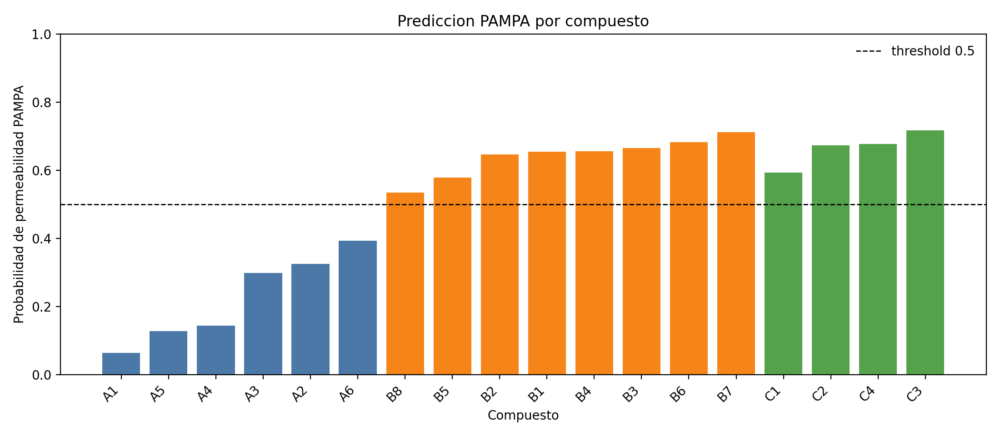
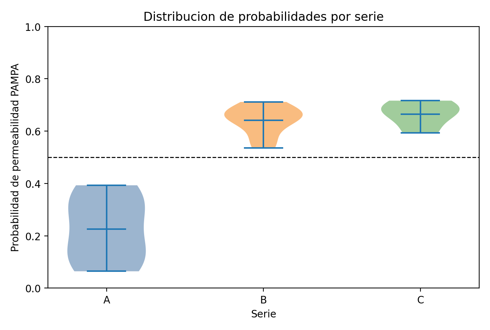
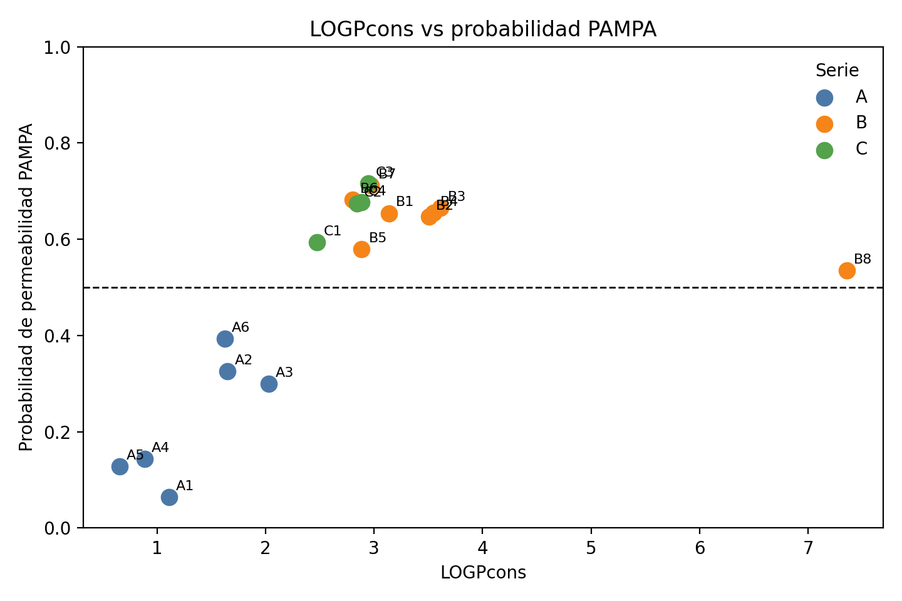

# Permeability-PAMPA

QSAR workflow for predicting passive intestinal permeability measured by PAMPA
using molecular descriptors, fingerprints and machine learning models.

This repository (`bvasquezp/Permeability-PAMPA-ML`) is the reproducible version
prepared to accompany the manuscript. The final thesis PDF is stored in
`docs/thesis/Tesis_QSAR.pdf`, and the curated databases were verified against the
historical repository `bvasquezp/Permeability-PAMPA`.

## Project Summary

The goal is to identify molecules with favorable passive intestinal permeability
using PAMPA as the experimental reference. The final model is a Random Forest
classifier trained on selected physicochemical and structural descriptors. The
workflow also includes external validation, applicability-domain analysis,
SHAP-based interpretability and virtual screening of DrugBank candidates.

## Quick Start

For the fastest reproducibility check after cloning the repository:

```powershell
python -m pip install -r requirements.txt
python src/run_reproducibility_pipeline.py --skip-model-comparison --skip-manuscript-assets --mlflow-preview
```

For the full user manual, see
[`docs/MANUAL_REPRODUCIBILIDAD.md`](docs/MANUAL_REPRODUCIBILIDAD.md).

## Repository Structure

- `data/`: final datasets used by the clean workflow.
- `notebooks/`: main notebooks for preparation, modeling and virtual screening.
- `src/`: maintained scripts that replace exploratory code from the thesis work.
- `models/`: serialized final model.
- `results/`: metrics, figures and final screening outputs.
- `references/papers/`: papers and PDF documents used as bibliography/background.
- `docs/`: thesis, poster and auxiliary tables.
- `archive/source_material/`: ordered archive of historical material from
  `BD PAMPA` and `QSAR`.
- `requirements.txt` / `environment.yml`: reproducible Python environments.

## Installation

Using conda:

```powershell
conda env create -f environment.yml
conda activate permeability-pampa
```

Using pip:

```powershell
python -m venv .venv
.\.venv\Scripts\Activate.ps1
python -m pip install -r requirements.txt
```

Optional MLOps tooling for experiment tracking and data-versioned pipelines:

```powershell
python -m pip install -r requirements-mlops.txt
```

Validate that the core datasets, screening outputs and final model match this
repository version:

```powershell
python src/validate_project.py
```

Recompute the final model metrics and compare them with the stored thesis
results:

```powershell
python src/check_final_metrics.py
```

Run the automated reproducibility pipeline:

```powershell
python src/run_reproducibility_pipeline.py --mlflow-preview
```

This builds a data manifest, validates file integrity, reproduces the final
metrics, optionally compares classical classifiers, creates an MLflow-compatible
payload preview and regenerates manuscript assets.

## Final Model

The selected thesis model is a `RandomForestClassifier` trained with 11 final
descriptors:

- `LOGPcons`
- `MACCSFP125`
- `PCR`
- `Psi_e_A`
- `P_VSA_ppp_D`
- `Mp`
- `SpMin1_Bh(p)`
- `SHED_AL`
- `SM12_AEA(ri)`
- `P_VSA_s_3`
- `MATS5m`

Serialized model:

- `models/best_rf_pampa.pkl`

## Main Data

- `data/raw/training_11.csv`: training set with the 11 final descriptors.
- `data/raw/test_11.csv`: internal validation set.
- `data/raw/external_11.csv`: independent external validation set.
- `data/raw/*_50.csv`: previous feature-selection/reduction stage.
- `data/processed/*_11_processed.csv`: processed copies used by the notebooks.

The original names in the first repository were `FINAL_Training.csv`,
`FINAL_Test.csv`, `FINAL_External.csv`, `training_final.csv`, `test_final.csv`
and `external_final.csv`. The file mapping and SHA256 hashes are documented in
`data/README.md`.

## Final Results

Metrics:

- `results/metrics/evaluacion_final_datasets.csv`
- `results/metrics/cv_results_comparison.csv`

Figures:

- `results/figures/`

Screening:

- `results/screening/Pre_Cribado_5_Moleculas.csv`: prospective test with five
  molecules unseen by the model.
- `results/screening/Reporte_Lipinski_Candidatos.csv`: Lipinski evaluation for
  the pre-screening candidates.
- `results/screening/DrugBank_Candidatos_Tesis.csv`: final DrugBank screening
  output after applicability-domain, probability and drug-likeness filters.

The complete DrugBank source used for screening contained more than 10000
compounds. Historical screening inputs are stored in
`archive/source_material/qsar_inputs/`. Large local DrugBank exports over 100 MB
are intentionally ignored by Git and are not required to validate the final
screening output.

## Reproducible Scripts

### MLOps, ETL/ELT and CI/CD

The repository now includes a lightweight MLOps layer intended to make the QSAR
workflow auditable by other researchers:

- `params.yaml`: central project, model, validation and screening parameters.
- `src/build_data_manifest.py`: ETL/ELT audit step that records file sizes,
  row/column counts and SHA256 hashes for curated datasets, model artifacts and
  screening outputs.
- `src/run_reproducibility_pipeline.py`: one-command runner for validation,
  metric reproduction, optional model comparison, MLflow payload preview and
  manuscript asset generation.
- `src/mlflow_tracking.py`: logs parameters, final metrics and selected
  artifacts to MLflow when optional dependencies are installed; `--dry-run`
  writes the payload without requiring MLflow.
- `dvc.yaml` and `.dvcignore`: DVC-compatible pipeline definition for data
  lineage and reproducible stages. A remote DVC storage can be added later for
  large proprietary DrugBank/alvaDesc exports.
- `.github/workflows/ci.yml`: CI checks for GitHub Actions. On push, pull
  request or manual dispatch it builds the manifest, validates core files,
  reproduces final metrics and creates the MLflow payload preview.

Run only the core automated checks:

```powershell
python src/run_reproducibility_pipeline.py --skip-model-comparison --skip-manuscript-assets --mlflow-preview
```

Preview the MLflow run payload:

```powershell
python src/mlflow_tracking.py --dry-run
```

With the optional MLOps dependencies installed, log a local MLflow run:

```powershell
python src/mlflow_tracking.py
```

With DVC installed, reproduce the declared stages:

```powershell
dvc repro
```

Convert CSV to ARFF for WEKA:

```powershell
python src/csv_to_arff.py data/raw/training_11.csv results/weka/training_11.arff --relation pampa_11
```

Generate WEKA commands equivalent to the historical `weka_cmd1.py`:

```powershell
python src/weka_feature_selection.py generate --weka-jar D:/Weka-3-6/weka.jar --input-arff results/weka/training_11.arff --output results/weka/commandlines.txt
```

Run the 10 WEKA selector combinations in parallel:

```powershell
python src/weka_feature_selection.py run --weka-jar D:/Weka-3-6/weka.jar --input-arff results/weka/training_11.arff --logs-dir results/weka/logs --workers 4
```

Rebuild the thesis alvaDesc/fingerprint feature-selection route from the
historical ARFF and WEKA artifacts:

```powershell
python src/audit_thesis_feature_pipeline.py
python src/rebuild_thesis_feature_pipeline.py
```

This reconstructs the 783-feature fused table, applies the EDA filters
(`VarianceThreshold=0.05`, Mann-Whitney `alpha=0.05`, Spearman `|r|>0.90`),
parses the legacy WEKA consensus, applies the historical 0.4 consensus threshold
against the observed maximum vote count, and audits optimized 11-feature panels
against the exact 11 descriptors used in the thesis. Outputs are written to
`results/thesis_feature_pipeline/`.

### Governed RDKit surrogate screening

The thesis model remains the validated scientific baseline because it uses the
11 descriptors selected from the alvaDesc/WEKA workflow. The RDKit route is now
handled as a governed surrogate candidate: it can be trained and audited from
SMILES, but MCP/agents must not treat it as approved unless it passes the metric
gates in `models/model_registry.json`.

First audit the SMILES workbook and rebuild the corrected RDKit datasets:

```powershell
python src/audit_rdkit_dataset.py
```

This validates the target inversion rule (`Target_corrected = 1 - Target`),
reports duplicate/conflicting structures, and writes:

- `data/processed/rdkit_original_split_corrected.csv`
- `data/processed/rdkit_pampa_compounds.csv`
- `results/diagnostics/rdkit_dataset_audit.json`
- `results/diagnostics/rdkit_dataset_duplicates.csv`

Train a candidate surrogate with the formal gates:

```powershell
python src/train_rdkit_candidate.py
```

Train the calibrated v2 candidate that mirrors the thesis operating strategy
(undersampling-aware interpretation plus asymmetric class weights and an
internal decision-threshold search):

```powershell
python src/train_rdkit_candidate.py --candidate-id rdkit_surrogate_candidate_v2 --tune-class-weight --tune-threshold
```

Train a strict thesis-protocol RDKit surrogate with fixed 5-fold CV,
majority-class undersampling, `class_weight={0: 1.5, 1: 1}` and decision
threshold `0.5`:

```powershell
python src/train_rdkit_candidate.py --candidate-id rdkit_surrogate_candidate_v3_thesis_protocol --thesis-protocol
```

To attack the representation gap, train the same thesis protocol with a broader
RDKit+MACCS panel before feature selection:

```powershell
python src/train_rdkit_candidate.py --candidate-id rdkit_surrogate_candidate_v4_rdkit_maccs_thesis_protocol --thesis-protocol --feature-space rdkit_maccs
```

For a quick development smoke test, use fewer folds and trees:

```powershell
python src/train_rdkit_candidate.py --candidate-id rdkit_surrogate_candidate_v2 --tune-class-weight --tune-threshold --n-splits 2 --n-repeats 1 --selection-estimators 30 --final-estimators 80
```

The candidate writes:

- `models/rdkit_surrogate_candidate_v2.pkl`
- `models/model_registry.json`
- `results/metrics/rdkit_surrogate_candidate_v2_cv.csv`
- `results/metrics/rdkit_surrogate_candidate_v2_weight_threshold_grid.csv`
- `results/metrics/rdkit_surrogate_candidate_v2_internal_thresholds.csv`
- `results/metrics/rdkit_surrogate_candidate_v2_internal.csv`
- `results/metrics/rdkit_surrogate_candidate_v2_external.csv`
- `results/metrics/rdkit_surrogate_candidate_v2_gate_report.json`

For thesis-protocol runs, replace `rdkit_surrogate_candidate_v2` with
`rdkit_surrogate_candidate_v3_thesis_protocol` in the artifact names.

MCP prediction is deliberately blocked for scientific decisions when no approved
SMILES model is active:

```powershell
python src/agentic/mcp_server.py predict "CC(=O)Oc1ccccc1C(=O)O"
```

The response includes `approved_for_decision=false` unless a model has status
`approved` in the registry.

### Science-skill style workflows

This repository includes local workflows inspired by Google DeepMind Science
Skills, adapted to the PAMPA thesis rather than installed as an external
Antigravity plugin:

- `skills/pampa_computational_discovery/SKILL.md`: exact thesis-replica
  prediction from the 11 selected alvaDesc/WEKA descriptors.
- `skills/pampa_literature_insights/SKILL.md`: manuscript citation audit and
  optional open-access literature search.

Validate a descriptor panel:

```powershell
python -m src.science_skills.pampa_computational_discovery validate-panel --input data/raw/test_11.csv
```

Predict from the exact thesis descriptors:

```powershell
python -m src.science_skills.pampa_computational_discovery predict-panel --input data/raw/test_11.csv --output results/science_skills/test_11_predictions.csv
```

Run the local no-API agent panel over a descriptor table:

```powershell
python src/agentic/local_orchestrator.py --input data/query/example_positive_negative_11.csv --output results/agentic/local_agent_predictions.csv --report-json results/agentic/local_agent_report.json --report-md results/agentic/local_agent_report.md --id-column example_id
```

This deterministic panel uses `DescriptorAgent`, `ChemicalAgent`,
`ModelAgent`, `ApplicabilityDomainAgent`, `PhysicsAgent` and `ReportAgent`
without calling an external LLM API. The validated thesis prediction always
comes from `models/best_rf_pampa.pkl` and the exact 11 alvaDesc/WEKA
descriptors.

Audit manuscript references:

```powershell
python -m src.science_skills.pampa_literature_insights audit-manuscript --tex manuscript/pampa_qsar_manuscript.tex --bib manuscript/references.bib
```

Rebuild the external PubChem bridge, recover missing SMILES, and compare the thesis external panel with the RDKit surrogate on the same 486 compounds:

```powershell
python src/rebuild_and_compare_external.py
```

Build the descriptor-vote consensus table from WEKA logs:

```powershell
python src/weka_feature_selection.py consensus --input-arff results/weka/training_11.arff --logs-dir results/weka/logs --output results/weka/descriptor_consensus.csv
```

Compare classical classifiers on the 11 final descriptors:

```powershell
python src/evaluate_models.py --dataset data/raw/training_11.csv --output results/metrics/model_comparison.csv
```

Check that the serialized Random Forest reproduces the final training, internal
test and external validation metrics:

```powershell
python src/check_final_metrics.py
```

Rebuild the `MoleculeN -> DrugBank_ID` translator from the SDF:

```powershell
python src/rebuild_drugbank_ids.py --sdf archive/source_material/qsar_inputs/allCOR3D.sdf --output archive/source_material/qsar_inputs/Lista_DrugBank_IDs.csv
```

## Notebooks

The notebooks are written as a step-by-step manual for non-programmer reviewers.
Each notebook starts with an editable configuration cell that indicates where to
change input files.

- `notebooks/01_Analisis_y_preparacion_datos.ipynb`: inspect curated training,
  internal test and external validation tables.
- `notebooks/02_Entrenamiento_RandomForest.ipynb`: load the final Random Forest,
  reproduce metrics and inspect feature importance.
- `notebooks/03_Cribado_Virtual_PAMPA.ipynb`: predict new molecules from a CSV
  containing the 11 thesis descriptors.
- `notebooks/04_Reconstruccion_dataset_tesis.ipynb`: rebuild the 783-feature
  alvaDesc/fingerprint matrix from legacy ARFF files.
- `notebooks/05_EDA_WEKA_seleccion_descriptores.ipynb`: inspect EDA, RFE, WEKA
  consensus and 11-feature panel optimization.
- `notebooks/06_Validacion_modelo_tesis.ipynb`: validate the serialized thesis
  model against stored results.
- `notebooks/07_Prediccion_nuevas_moleculas_agentes_locales.ipynb`: run the
  deterministic no-API agent panel for new candidate molecules.
- `notebooks/08_Herramienta_interactiva_series_ABC.ipynb`: guided notebook tool to
  generate preliminary SMILES for series A/B/C or generic SMILES inputs, run
  RDKit/Lipinski triage, prepare the alvaDesc 11-descriptor template and inject
  completed descriptors into the local PAMPA agent panel.

Recommended order:

```text
01 -> 02 -> 03 -> 04 -> 05 -> 06 -> 07 -> 08
```

The notebooks call maintained scripts in `src/` whenever possible, so the
interactive explanation and automated pipeline share the same logic.

## Candidate Series A/B/C Screening Example

The example panel in `notebooks/08_Herramienta_interactiva_series_ABC.ipynb`
uses the thesis model with the 11 alvaDesc/WEKA descriptors. The alvaDesc
exports were merged with:

```powershell
python src/merge_alvadesc_exports.py --descriptors "%USERPROFILE%\Downloads\descriptores0-2D.txt" --maccs "%USERPROFILE%\Downloads\MACCS166.txt" --output data/query/candidate_compounds_alvadesc_11_from_exports.csv
```

Predictions are available in:

- `results/agentic/candidate_compounds_alvadesc_predictions.csv`
- `results/agentic/candidate_compounds_alvadesc_report.md`
- `results/screening/candidate_compounds_rdkit_triage.csv`

Summary:

| Series | Compounds | Model outcome |
| --- | ---: | --- |
| A | 6 | 6/6 predicted non-permeable |
| B | 8 | 8/8 predicted permeable |
| C | 4 | 4/4 predicted permeable |

Top predicted permeable candidates:

| Compound | Probability permeable |
| --- | ---: |
| C3 | 0.717 |
| B7 | 0.711 |
| B6 | 0.682 |
| C4 | 0.677 |
| C2 | 0.674 |

Prediction overview:



Series distribution:



Descriptor trend:



## Historical Material

`archive/source_material/` contains the historical files that were previously
dispersed across `BD PAMPA/` and `QSAR/`. They are preserved for traceability,
while the reproducible workflow lives in `data/`, `notebooks/`, `src/`,
`models/` and `results/`.
