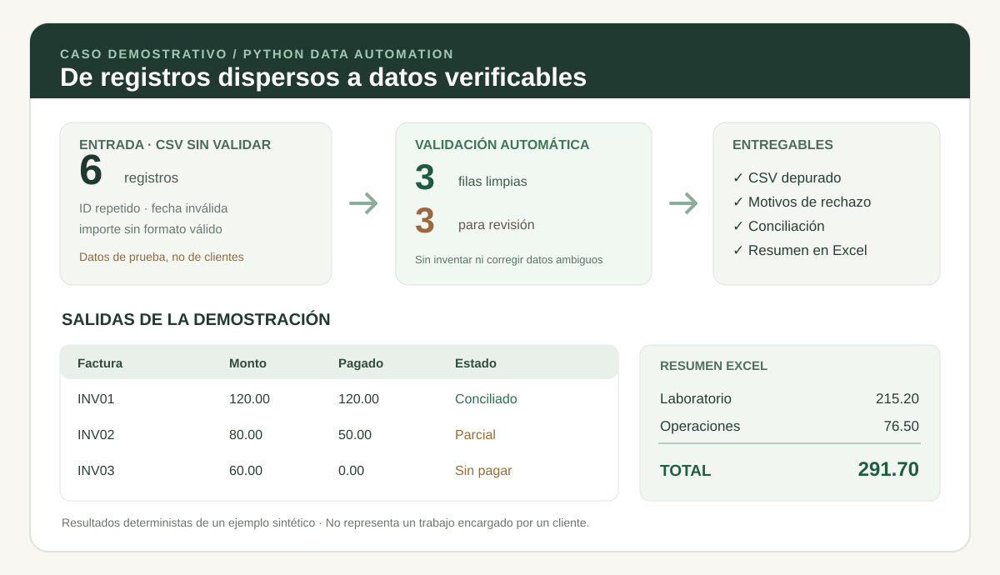

# Caso de portafolio | Automatización de Excel y CSV con Python

> **Demo con datos sintéticos.** No representa un encargo real ni un resultado obtenido con datos de clientes. **Lectura estimada: 2 minutos.**

## El problema

Un equipo recibe archivos de movimientos, facturas y pagos. Identificadores duplicados, fechas incorrectas y montos inválidos dificultan elaborar reportes confiables y conciliar registros.

## La solución demostrada

Un script de Python reproducible que:

1. comprueba identificadores, fechas e importes;
2. conserva los registros válidos en CSV y deriva los errores a un registro de revisión;
3. concilia facturas con pagos por **identificador exacto**;
4. marca facturas conciliadas, parciales, sin pagar y pagos sin factura asociada;
5. genera un resumen por categoría en **Excel** cuando está instalado `openpyxl`.

**Antes → después (ejemplo sintético):**

| Indicador | Antes | Después |
|---|---|---|
| Registros de entrada | 6 sin validar | 3 limpios + 3 señalados para revisión |
| Pagos | Registros dispersos | 1 conciliado, 1 parcial, 1 sin pagar, 1 pago no asociado |
| Resumen | Cálculo manual | Excel por categoría (total de registros válidos: **291,70** unidades monetarias) |
| Auditoría | Sin trazabilidad de rechazos | CSV de rechazos y resumen JSON |

> No se estiman pagos desconocidos ni se corrigen automáticamente registros ambiguos. Los resultados mostrados corresponden **únicamente al código de demostración**, no a un sistema de contabilidad productivo.

## Entregables de ejemplo

- `clean_records.csv`: registros validados.
- `rejected_records.csv`: errores y motivo del rechazo.
- `reconciliation.csv`: estado por factura y excepciones.
- `summary.xlsx`: totales por categoría.
- `quality_summary.json`: conteos y control de calidad.
- Código Python documentado + instrucciones de ejecución.

[**Ver el código ejecutable**](demo.py) · [**Ver la prueba automatizada**](test_demo.py) · [**Guía de ejecución**](README.md)

## Oferta comercial de referencia

**Paquete inicial orientativo: US$180–350**, sujeto a revisar los archivos reales y sus reglas de negocio.

| Incluye | Condiciones orientativas |
|---|---|
| Insumos | Hasta 2 archivos CSV/Excel; máximo 5.000 filas combinadas |
| Validación | Hasta 6 reglas acordadas antes del trabajo |
| Salidas | Archivos limpios, incidencias, un reporte Excel y script reutilizable |
| Entrega | Código, guía de ejecución y una revisión acotada |
| Tiempo estimado | 3–5 días hábiles tras recibir los archivos y requisitos |

**Fuera de alcance por defecto:** OCR de documentos escaneados, integraciones API, bases SQL, conciliación bancaria real, tableros en vivo, asesoría contable y tratamiento de datos sensibles sin un acuerdo previo. Excel como fuente requiere adaptar el script, ya que **el ejemplo publicado usa datos sintéticos integrados**; no pretende ser una aplicación lista para cualquier archivo.

### Criterios de aceptación

- El reporte registra todos los casos incluidos en el conjunto de pruebas.
- Ninguna fila inválida desaparece sin explicación.
- Los totales monetarios coinciden con las reglas definidas.
- Las instrucciones permiten repetir el proceso con el entorno acordado.

**¿Tienes un proceso manual repetitivo?** Para cotizar se requieren 1–2 ejemplos anonimizados de entrada, salida esperada y reglas de validación. La propuesta se adapta a los datos concretos.

[Versión en inglés para Upwork](CASE_STUDY_EN.md).
